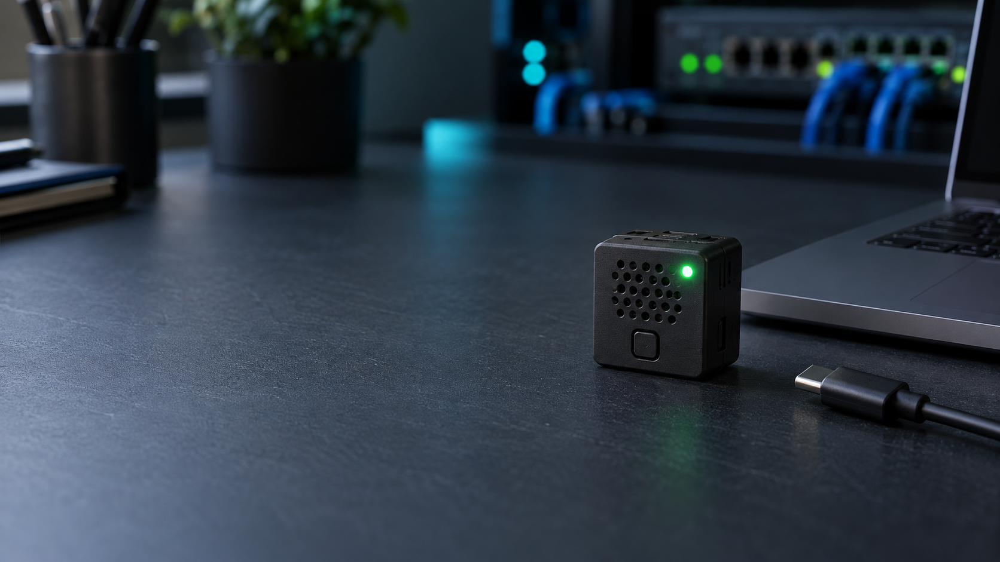

# Cursore

Assistente vocale con M5Stack Atom Echo originale e backend DietServer, senza Home Assistant.
Un unico repository contiene il lavoro svolto dal server e dal Mac.

**Per replicarlo:** seguire la [guida rapida per la propria rete](docs/quickstart.md).
Servono Atom Echo originale, un server Docker e un computer USB con ESP-IDF.
Il progetto è un prototipo: la wake word locale resta da implementare.



## Prima di lavorare da un altro computer

Leggere [collaborazione tra sessioni](docs/collaboration.md), [stato e passaggio di consegne](docs/handoff.md)
e [AGENTS.md](AGENTS.md). Codice e documenti Git sono condivisi; chat, credenziali e file di build no.

## Struttura

| Percorso | Contenuto |
|---|---|
| `server/` | Backend Python, provider e immagine Docker |
| `docker-compose.yml` | Solo cursore-server, usato sul DietServer |
| `firmware/` | Firmware ESP-IDF, build sul Mac e CI |
| `firmware/docker-compose.yml` | Build Docker firmware separata |
| `docs/` | Architettura, API, handoff e sito GitHub Pages |
| `wakeword/` | Percorso previsto per il futuro modello; nessun modello incluso |
| `.env.example` | Template backend senza chiavi |
| `firmware/main/secrets.example.h` | Template Wi-Fi senza password |

## Stato effettivo

Il backend dispone di health, upload PCM chunked, STT Groq Whisper in italiano,
LLM Groq GPT-OSS e TTS Piper persistente. Restituisce un URL temporaneo al WAV.
GeminiTTS è conservato nel codice ma non è utilizzato nel percorso attivo.
Non è attualmente sufficiente cambiare `TTS_PROVIDER` per selezionarlo.

Il firmware contiene Wi-Fi primaria/fallback, pulsante mute, LED, acquisizione PDM,
VAD adattivo, upload progressivo e riproduzione WAV I²S.

**La wake word locale “Cursore” non è implementata. Il firmware attuale avvia
l'upload al rilevamento VAD: il requisito di non inviare audio prima della wake word
non è ancora soddisfatto.** Non considerarlo pronto per l'ascolto ambientale.
L'integrazione del repository non modifica questo comportamento.

I benchmark delle chat precedenti possono riferirsi a provider e implementazioni
diversi. Vedere l'handoff per lo stato del codice, senza dedurre nuove prestazioni
dai vecchi numeri.

## Backend sul DietServer

Il servizio esistente usa `192.168.123.5:8766` e loopback. IP LAN e porta sono
configurabili in `.env` con CURSORE_LAN_IP e CURSORE_PORT. Il compose root è dedicato;
non modificare quello in `/root/DOCKER/docker-compose.yml`.

Solo su una nuova installazione e se `.env` non esiste:

```sh
cp .env.example .env
chmod 600 .env
# Impostare CURSORE_LAN_IP e GROQ_API_KEY. Non pubblicare il file.
```

```sh
docker compose config --quiet
# Build/avvio solo quando si intende distribuire sul DietServer:
docker compose up -d --build cursore-server
curl --fail http://127.0.0.1:8766/health
```

Nel `.env` impostare CURSORE_LAN_IP all'indirizzo LAN del proprio server e GROQ_API_KEY.
GEMINI_API_KEY è opzionale: Gemini non è chiamato dal percorso attivo.
Un clone sul Mac non implica avviare questo servizio. Vedere [server/README.md](server/README.md).

## Firmware sul Mac

Il vecchio progetto ESP-IDF nella root di GitHub è ora in `firmware/`.
Attivare l'ambiente ESP-IDF v6.0.3 del proprio Mac, poi:

```sh
cd firmware
# Solo se secrets.h non esiste:
cp main/secrets.example.h main/secrets.h
# Configurare localmente SSID e password.
# Impostare anche CURSORE_SERVER_HOST e CURSORE_SERVER_PORT nel secrets.h.
idf.py set-target esp32
idf.py build
```

Per istruzioni Docker e migrazione del vecchio clone vedere [firmware/README.md](firmware/README.md).
Il flash avviene soltanto sul Mac collegato via USB, su richiesta esplicita.

## Protocollo Atom v1

Dopo la futura wake word locale, l'Atom apre `POST /api/v1/requests` HTTP/1.1 con
`Transfer-Encoding: chunked`, inviando PCM signed 16-bit little-endian, mono, 16000 Hz.
Il VAD locale determina la fine e invia il chunk terminale zero.
Il server attende il completamento dell'upload prima dello STT, risponde JSON e
rende disponibile il WAV con `GET /api/v1/requests/<id>/audio`.
Content-Length resta supportato per test/interoperabilità.
Vedere [contratto API](docs/api.md).

## Sicurezza e licenze

Credenziali backend, Wi-Fi e autenticazione GitHub restano sui singoli computer.
Non pubblicare registrazioni, build contenenti password o file di autenticazione.
I workflow CI usano soltanto segnaposto e non flashano dispositivi.

La licenza MIT del firmware è conservata in [firmware/LICENSE](firmware/LICENSE).
Non viene estesa automaticamente al backend o alle sue dipendenze.
Piper OHF-Voice usa GPL-3.0-or-later; ogni voce ha condizioni proprie.
Prima di redistribuire immagini e modelli verificarne separatamente le licenze.

[Architettura](docs/architecture.md) · [Hardware](docs/specification.md) ·
[Wake word](docs/wake-word-feasibility.md) · [Pagina progetto](https://spacecdr.github.io/Cursore/)
