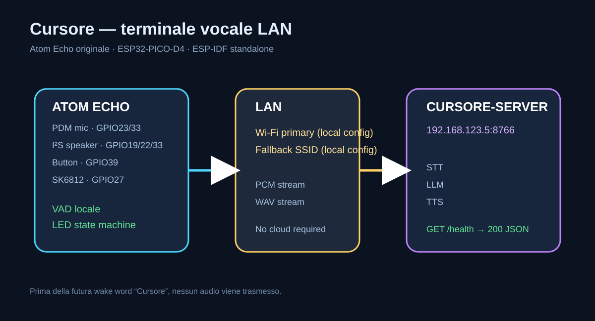

# Architettura Cursore

## Confini

L'Atom Echo è un terminale embedded: non esegue il modello LLM e non dipende da Home Assistant. Il backend LAN riceve il flusso PCM, coordina STT/LLM/TTS e restituisce audio WAV.

## Moduli firmware

- `main.c`: inizializzazione e composizione dei moduli.
- `wifi.c`: rete primaria/fallback, riconnessione e stato connesso.
- `button.c`: debounce e toggle globale READY/MUTED.
- `led_state.c`: driver SK6812 e macchina a stati visiva.
- `microphone.c`: PDM/I²S RX, calibrazione rumore, VAD, pre-roll e sessione audio.
- `server_client.c`: health check HTTP e stream TCP per audio in upload.
- `speaker.c`: download WAV progressivo e riproduzione stereo I²S.

## Sequenza audio

1. Il terminale è in `READY`.
2. Il VAD locale rileva energia sopra la soglia adattiva.
3. Il firmware passa a `LISTENING` e apre una richiesta audio.
4. Il pre-roll e i campioni successivi sono inviati progressivamente.
5. Dopo il timeout di silenzio il firmware chiude lo stream.
6. Il terminale passa a `PROCESSING`.
7. Il server risponde con un riferimento WAV.
8. Il firmware passa a `SPEAKING`, scarica il WAV a blocchi e lo riproduce.
9. Al termine torna a `READY`.

La memoria non contiene mai l'intera frase o l'intero WAV.

## Interruzione

Una pressione breve durante una sessione interrompe l'attività appena possibile e porta il terminale a `MUTED`. La connessione audio viene chiusa dal firmware.

## Futuro wake word

La wake word “Cursore” dovrà essere riconosciuta localmente, prima di aprire qualsiasi stream di rete. Il candidato tecnico è un modello INT8 compatto con TensorFlow Lite Micro/microWakeWord, da validare sui limiti RAM/flash dell'ESP32 originale. Vedi [wake-word-feasibility.md](wake-word-feasibility.md).
